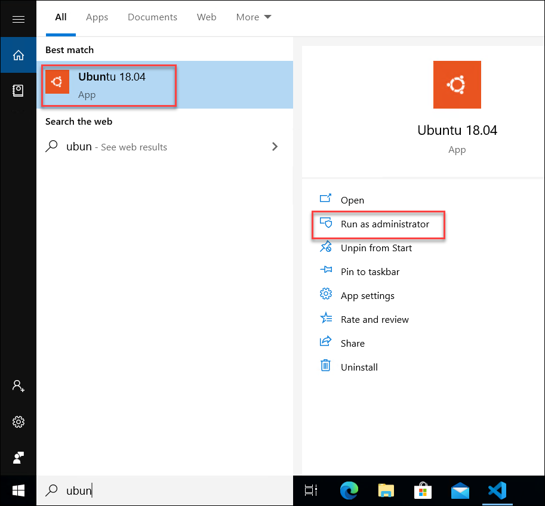
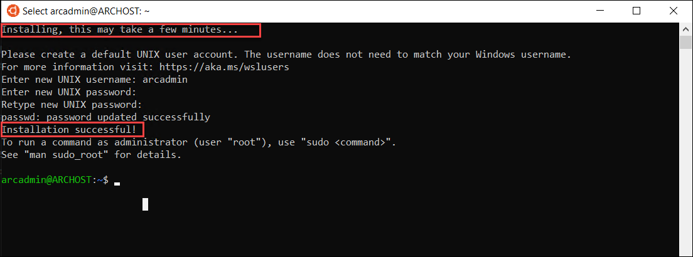
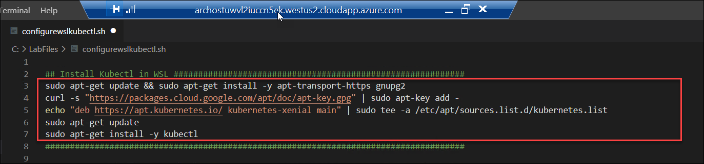
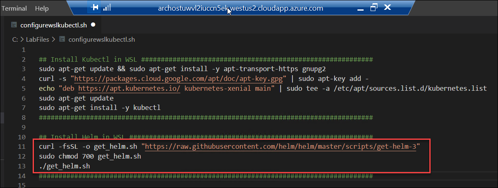
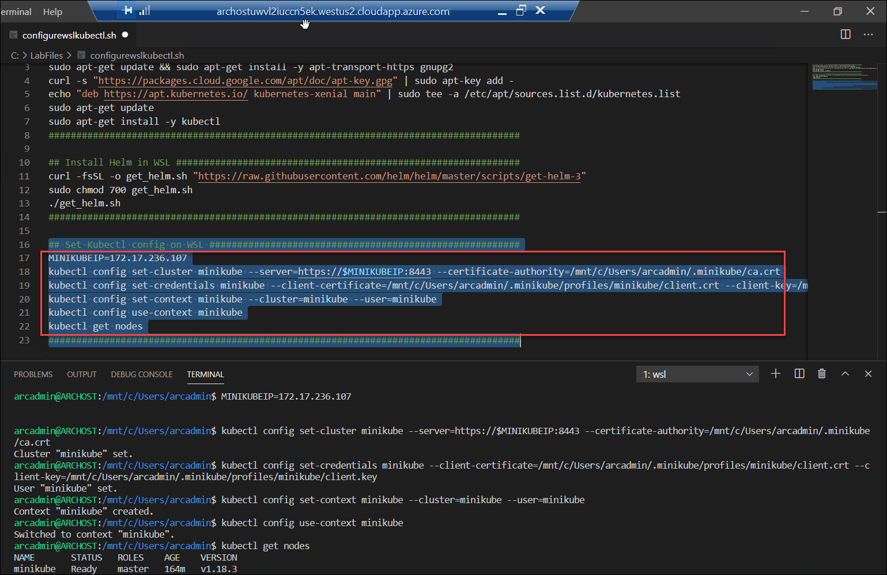

# Exercise 2: Getting started with On-Prem Kubernetes Cluster
In the provided lab environment, you would already have one Windows 10 machine running with Kubernetes Cluster already deployed and running. In this exercise, we’ll connect to the VM and check the existing Kubernetes Cluster

## Task 1: Verify existing Kubernetes Cluster
In this task, you will check the existing Kubernetes cluster and verify if the cluster is up and running. 

1. Type Visual Studio Code in the search bar on the bottom left corner of the VM, Open **Visual Studio Code** option that comes up

    

2. Click on the **Kubernetes** extension and verify whether a cluster with name **minikube** is present.
   
    
   
3. Open the **Powershell terminal** within the Visual studio code .
    
    

4. Run the following command to check the status of the cluster .
   
   ```
   minikube status
   ```
   If the cluster is running, the output from minikube status should be similar to:
   
    
   
   >Note: If the cluster status is **Stopped**,Run the following commands
   
   ```
   minikube delete
   ```
   
   ```
   minikube start
   ```
## Task 2: Configuring WSL environment on Windows
   
 1. Open the **Ubuntu 18.04** as a administrator
   
      
    
 2. When prompted for username and Password provide the username as **arcadmin** and Password as **123456** and wait until the application is installed.
 
     
  
## Task 3: Connect to Kubernetes cluster using WSL

1. Open the Visual studio code once again and run the following command in the terminal
   
   ```
   wsl
   ```
    
 
 2. Within the VS Code from the **file** menu open the file from the folder C:\LabFiles **configurewslkubectl.sh**
  
    
    
 3. Run the commands to **install Kubectl in WSL** one by one
   
    

4. Run the commands to **Install Helm in WSL** one command followed by next
 
   
 
5. Run all the commands at once **Set Kubectl config on WSL**
 
   
   
 6. Now you can run the command 'exit' to exit out of WSL and be back in the powershell terminal.
 
   ```
   exit
   ```
 
 7. You can chose to use any of the following methods -  Powershell through Visual Studio Code or throught direct Powershell terminal from the desktop for performing the remaining exercises

In this exercise, you explored about how to check the already onboarded Hybrid compute servers. In next exercise, you will explore more on onboarding the Azure Arc/Hybrid compute on-prem servers to Azure Arc.
