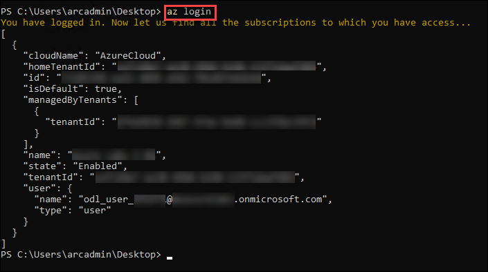
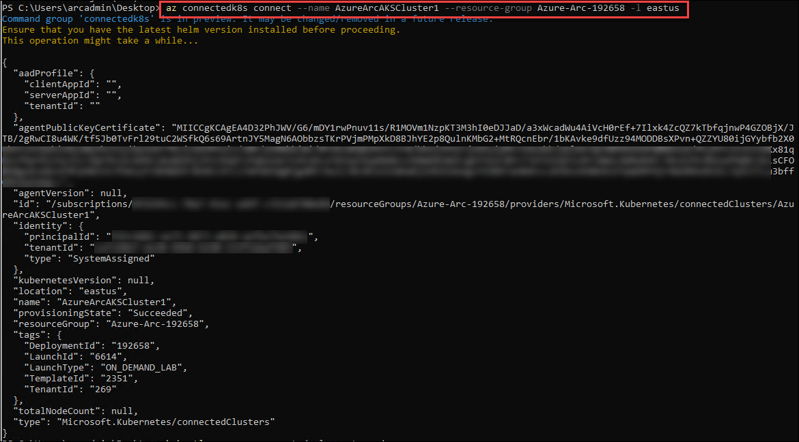
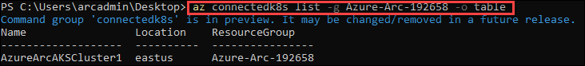
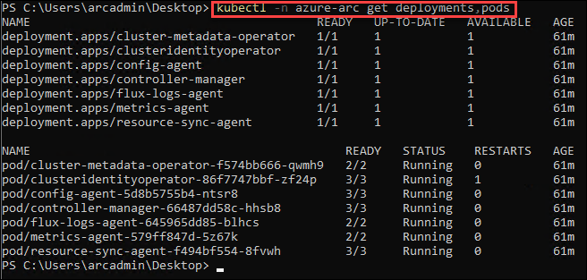

# Exercise 3: Onboard Kubernetes Cluster to Azure Arc
Azure Arc extends Azure Resource Manager capabilities to Linux and Windows servers, as well as Kubernetes clusters on any infrastructure across on-premises, multi-cloud, and edge. With Azure Arc, customers can also run Azure data services anywhere, realizing the benefits of cloud innovation, including always up-to-date data capabilities, deployment in seconds (rather than hours), and dynamic scalability on any infrastructure. Azure Arc for servers is currently in public preview.

## Task 1: Connect the cluster to Azure Arc
1. In the powershell window ,run the following command to login to azure
    
   ```
   az login
   ```
   This will launch a browser,Login with the credentials provided in the environment details page
   
    

2. Connect the Kubernetes cluster to Azure Arc by executing the following command:

   > Note: Replace the XXXXXX with the deploymentID provided in the environment details page


   ```
   az connectedk8s connect --name AzureArcAKSCluster1 --resource-group Azure-Arc-XXXXXX -l eastus
   ```
   
   > Note: This command will take around 20 mins to complete the execution
   
   The output should be similar as shown:
   
    

## Task 2: Verify if the Kubernetes cluster is connected to Azure Arc

In this task, you will verify if the Kubernetes cluster is connected to Azure Arc.

1. Verify whether the cluster is connected by running the following command:
   
   > Note: Replace the XXXXXX with the deploymentID provided in the environment details page


    ```
    az connectedk8s list -g Azure-Arc-XXXXXX -o table  
     ```
     
   
   
2. You can also View this resource on the Azure portal. Once you have the portal open in your browser, navigate to the resource group and there will be a resource with type **Azure Arc enabled Kubernetes resource**

   

2. Azure Arc enabled Kubernetes deploys a few operators into the azure-arc namespace. You can view these deployments and pods by running the command:


   ```
   kubectl -n azure-arc get deployments,pods
   ```
   
   The output should be similar as shown:
   
    
