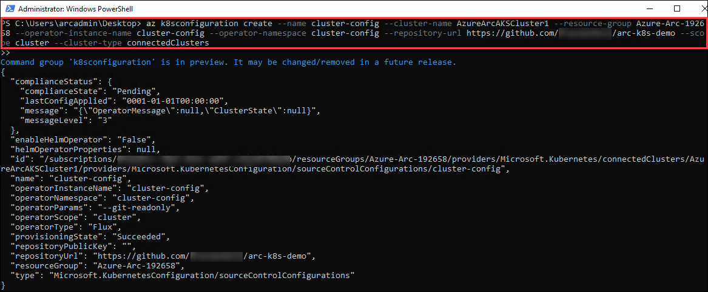
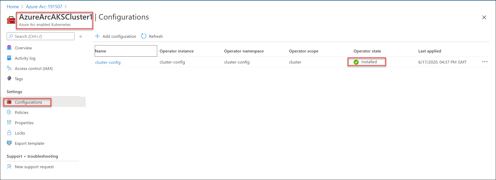
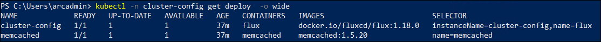

# Exercise 4: Deploy Sample Kubernetes App through Azure Arc

In this exercise, you will deploy a sample kubernetes app using az k8sconfiguration command and gitops.

## Task 1: Create a Configuration

1. Fork the repository https://github.com/Azure/arc-k8s-demo to your personal github account. As you will be making changes to the files in the repository.

## Task 2: Deploy App using az k8sconfiguration

1. Using the Azure CLI extension for k8sconfiguration, link connected cluster to personal git repository. Provide this configuration a name cluster-config, instruct the agent to deploy the operator in the cluster-config namespace, and give the operator cluster-admin permissions. 

2. Run the following command:
   - Replace the XXXXXX with the deploymentID provided in the environment details page
   - Replace **your personal github account name** with your personal github account that you are using to perform the lab.

   ```
   az k8sconfiguration create --name cluster-config --cluster-name AzureArcAKSCluster1 --resource-group Azure-Arc-XXXXXX --operator-instance-name cluster-config --operator-namespace cluster-config --repository-url https://github.com/<your personal github account name>/arc-k8s-demo --scope cluster --cluster-type connectedClusters
   ```
   
   The output should be as shown:

    
   
     > Note: Wait for 5 mins before performing the next step

## Task 3: Validate the sourceControlConfiguration

1. Validate whether the sourceControlConfiguration was successfully created and the compliance state is Installed. If it is pending, retry the same command again after sometime.

   ```
   az k8sconfiguration show --resource-group Azure-Arc-XXXXXX --name cluster-config --cluster-name AzureArcAKSCluster1 --cluster-type connectedClusters
   ```
     > Note: that the sourceControlConfiguration resource is updated with compliance status, messages, and debugging information in the output.

   The output should be as shown:

    
  
2. Navigate to **Azure-Arc RG->AzureArcAKSCluster1->Configurations**. Ensure that the operator state status should show as **Installed**.

    
  
## Task 4:  Validate the Kubernetes configuration

1. After config-agent has installed the flux instance, resources held in the git repository should begin to flow to the cluster. Check to see that the namespaces, deployments, and resources are created by **Running the following command:**

   ```
   kubectl get ns --show-labels
   ```
 
   The output shows that team-a, team-b, itops, and cluster-config namespaces have been created as shown:
  
    
   
2. The flux operator will be deployed to cluster-config namespace, as directed by our sourceControlConfig:
      
    ```
    kubectl -n cluster-config get deploy  -o wide
    ```
   
    The output should be as shown:
   
     
  
3. You can explore the other resources deployed as part of the configuration repository by running the following commands:

   ```
   kubectl -n team-a get cm -o yaml
   ```
   
   ```
   kubectl -n itops get all
   ```
