# Exercise 5: Azure Governance for Kubernetes on Azure Arc

## Task 1: Apply Policy
Policies can be applied to ARC enabled Kubernetes the same way they are applied to Microsoft Azure virtual machines. Policies can be applied to ensure the Azure resources are compliant with established practices such as ensuring that all resources are tagged with an owner. Policies can be applied to ensure the Azure arc enabled clusters are compliant such as ensuring the cluster configuration is set through a specific repo or enforcing a specific label on a pod.

1. From the Azure Portal (https://portal.azure.com ), navigate to the resource group you have access to and click on AzureArcAKSCluster1 resource. 

     

2. From the **Azure Arc Enabled Kuberenetes** blade, click on **Go to Policies** under Configure Azure Policy.

     

3. Click **Assign policy**.

     

4. On the Basics Tab, click on the ellipses (…) to the right of **Policy definition**.

     

5. In the **Search** window for available definitions, type “Kubernetes ” and select the one called **Deploy GitOps to Kubernetes cluster**.  Click the blue **Select** button below.

     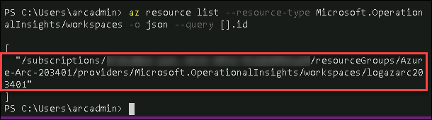

6. Click **Next** at the bottom of the window.

7. Provide the following details under **Parameters** tab and Click **Next**
   - Configuration resource name: **cluster-config**
   - Operator resource name: **cluster-config**
   - Operator namespace: **cluster-config**
   - Operator scope: **cluster**
   - Operator type: **Flux**
   - Operator Parameters: **--git-readonly**
   - Repository URL: The forked repo of **https://github.com/Azure/arc-k8s-demo** that you are using for performing the lab
   - Set the **Enable helm** option to **false**
   - **Leave the other options set to default**
     
   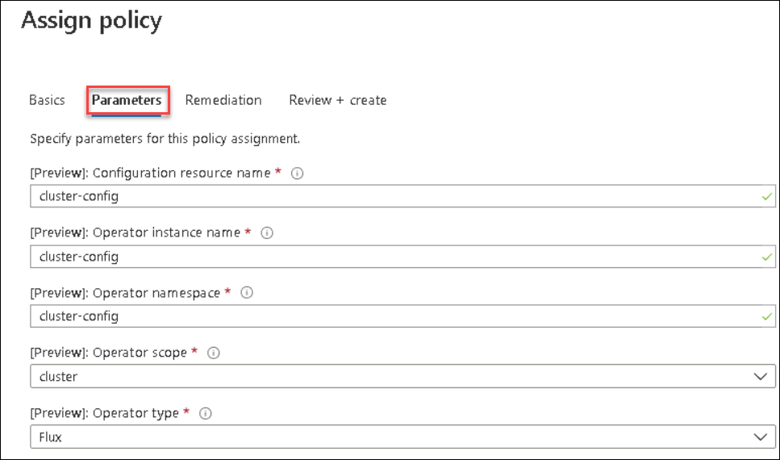   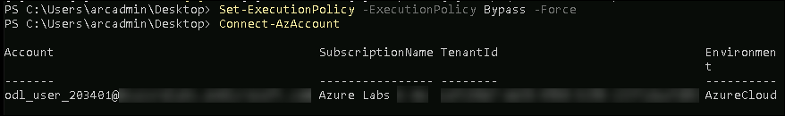 
   
8. Select the **Create a remediation task** check box and then click **Review+create** 

     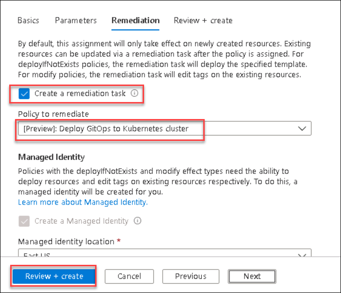

10. Navigate to **Azure-Arc RG** -> **AzureArcAKSCluster1** -> **Policies**.

11. You can check if your cluster is **compliant** or **not** against **“[Preview]:Deploy GitOps to Kubernetes cluster”** policy you assigned in previous step by looking at the Compliance State Column

     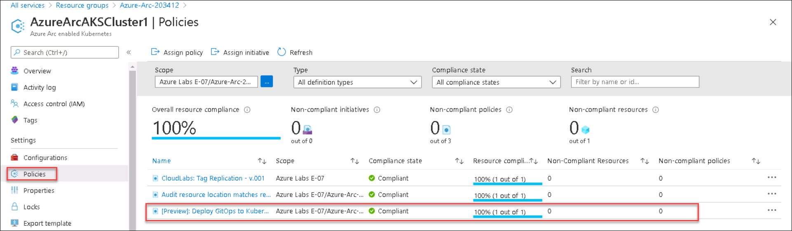
     
   > **Note**: The Compliant shows as **non-compliant**, you will need to create a remediation task in the next task and after sometime you will see the complaint state changed to **Compliant**
   
## Task 2: Create a remediation task

During evaluation, the policy assignment with deployIfNotExists or modify effects determines if there are non-compliant resources. When non-compliant resources are found, the details are provided on the Remediation page. Along with the list of policies that have non-compliant resources is the option to trigger a remediation task. This option is what creates a deployment from the deployIfNotExists template or the modify operations.

To create a remediation task, follow these steps:

1. Launch the Azure Policy service in the Azure portal by clicking **All services**, then searching for and selecting **Policy**.
   
   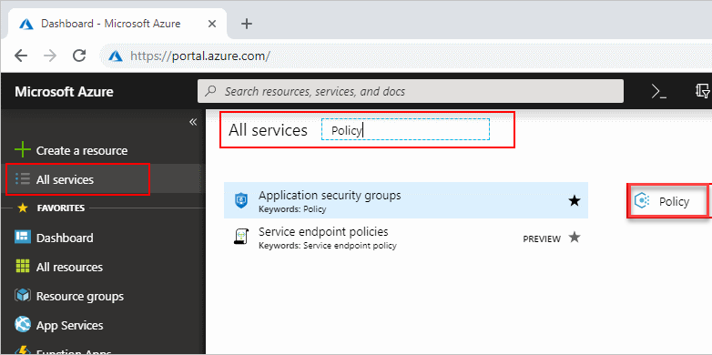

2. Select **Remediation** on the left side of the Azure **Policy** page.
  
   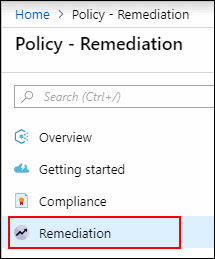

3. All deployIfNotExists and modify policy assignments with non-compliant resources are included on the **Policies to remediate** tab and data table. **Click on “[Preview]:Deploy GitOps to Kubernetes cluster” policy**. The New remediation task page opens.
  
   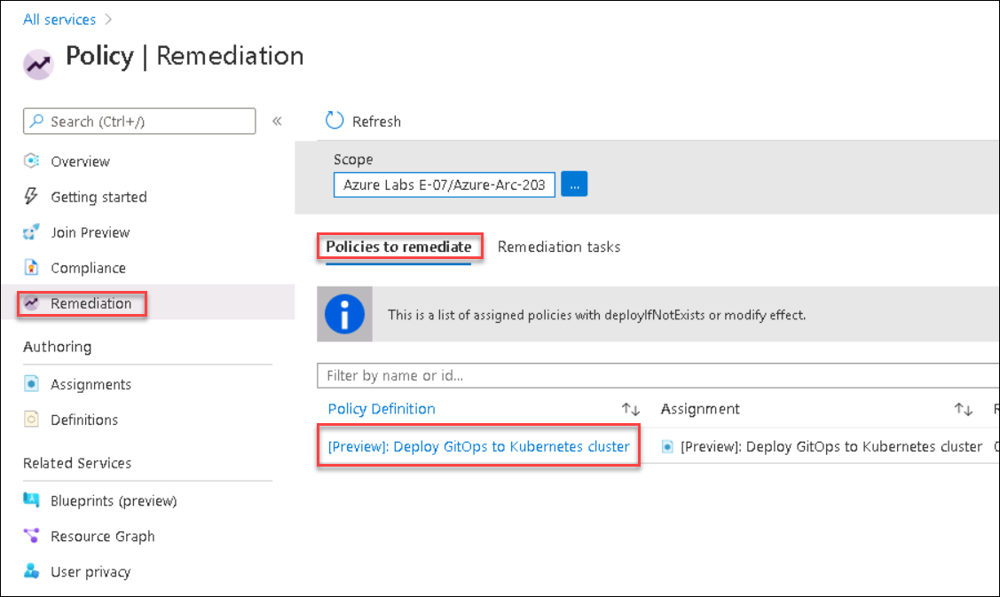

4. On the **New remediation task** page, filter the resources to remediate by using the **Scope** ellipses and select **Kubernetes Cluster** from where the policy is assigned   Additionally, use the Locations drop-down to further filter the resources. Only resources listed in the table will be remediated.
  
   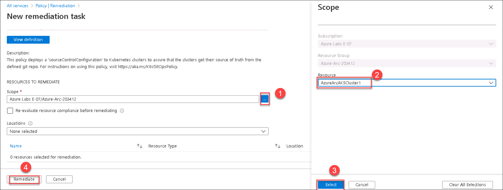

5. The policy compliance page opens to the Remediation tasks tab to show the state of the tasks **in progress**. Deployments created by the remediation task begin right away.

   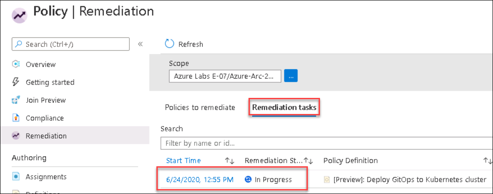

6. Click on the **remediation task** from the policy compliance page to get details about the progress. The filtering used for the task is shown along with a list of the resources being remediated.

7. You should now see Remediation status as **Complete** 
   
   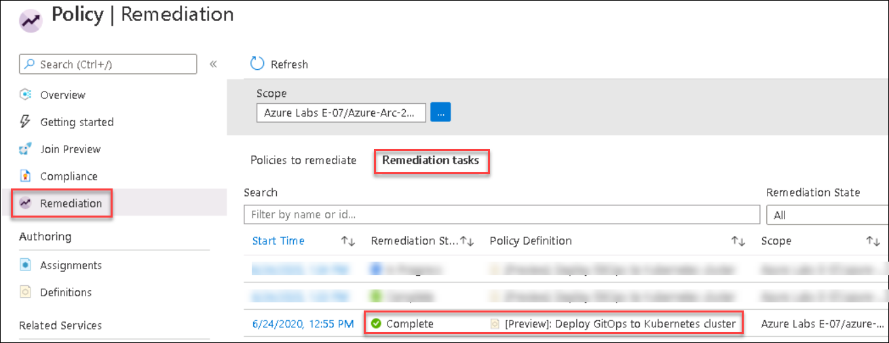

