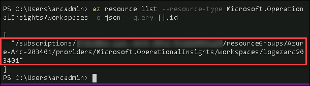
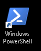
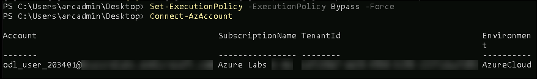
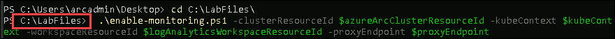
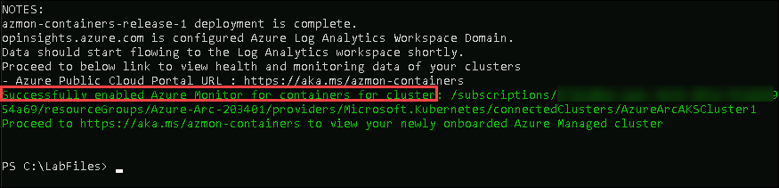
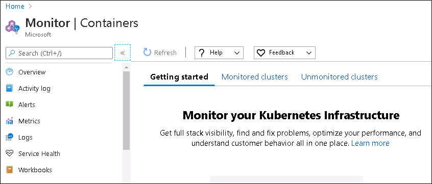
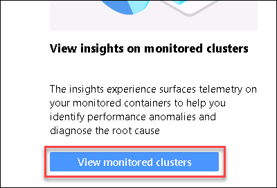
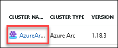

# Exercise 6 : Setup Azure Monitor On Connected Cluster

Azure Monitor for containers provides rich monitoring experience for the Azure Kubernetes Service (AKS) and AKS Engine clusters. With Azure Monitor for containers, you can use the performance charts and health status to monitor the workload of Kubernetes clusters
In this exercise, we will see how to enable monitoring of your Kubernetes clusters hosted outside of Azure that are enabled with Azure Arc, to achieve a similar monitoring experience.

## Task 1: Identify Log Analytics Workspace Resource Id

To enable monitoring of the connected cluster and integrate with an existing Log Analytics workspace, perform the following steps to first identify the full resource ID of the existing Log Analytics workspace. 
This is required for the workspaceResourceId parameter when you run the command to enable the monitoring add-on against the specified workspace

1.  Run the following command in Powershell window to get the resource Id of the Log Analytics workspace. Copy this Id to be used in the next tasks.

    ```
    az resource list --resource-type Microsoft.OperationalInsights/workspaces -o json --query [].id
    ```
       


## Task2: Enable monitoring using PowerShell

1.  Open **Windows Powershell** from the Desktop 

     

2.  Run the following command in Powershell to login to Azure Portal using Az Powershell Module. When Prompted for Username/Password, provide the details from Lab Environment Tab on the right.
 
    ```
    Set-ExecutionPolicy -ExecutionPolicy Bypass -Force
    Connect-AzAccount
    ```
       
    
3.  Provide Log Analytics Workspace Id and Azure Arc Cluster ID in the following commands, keep $kubeContext and $proxyEndpoint as "" :
 
    ```
    $azureArcClusterResourceId = "Update Azure Arc Enabled Kubernetes Id here"
    $logAnalyticsWorkspaceResourceId = "Update Log Analytics Workspace Id here"
    $kubeContext = ""
    $proxyEndpoint = ""
    ```
    
4.  Run the following command to change the directory to C:\
 
    ```
    cd C:\
    ```
    
5.  Now, Run the following commands to enable monitoring
 
    ```
    wget https://aka.ms/enable-monitoring-powershell-script -outfile enable-monitoring.ps1
    .\enable-monitoring.ps1 -clusterResourceId $azureArcClusterResourceId -kubeContext $kubeContext -workspaceResourceId $logAnalyticsWorkspaceResourceId -proxyEndpoint $proxyEndpoint
    ```
      
    
6.  Once the executing is complete, you will see the output as shown below
 
      
    
7.  After you've enabled monitoring, it may take some time to establish monitoring data flow for newly created clusters. Please allow at least 10-15 minutes for data to appear for your cluster.
 
8.  Open a new tab in browser in the VM and navigate to 
 
    ```
    https://aka.ms/azmon-containers
    ```
    
    This will take you to the Monitoring page.
    
         
    
9.  On the monitor page, scroll down and Click on **View monitored clusters** button 
 
      
    
10.  Then Click on the Cluster that is listed 

      

11.  On the blade that comes up, you can see six tabs:

        - What's New 
        - Cluster
        - Health (Preview)
        - Nodes
        - Controllers
        - Containers

   Select the Cluster tab and it displays four line performance charts that show key performance metrics of your cluster:
    
        - Node CPU utilization
        - Node memory utilization
        - Node count
        - Active pod count   
    
   
    
    
12.  Switch to the Nodes tab and the row hierarchy follows the Kubernetes object model, which starts with a node in your cluster. Expand the node to view one or more pods running on the node. If more than one container is grouped to a pod, they're displayed as the last row in the hierarchy. You also can view how many non-pod-related workloads are running on the host if the host has processor or memory pressure.
 
    
    
13.  In the selector, select Controllers. Here you can view the performance health of your controllers and Container Instances virtual node controllers or virtual node pods not connected to a controller.
 
    

14.  In the selector, select Containers. Here you can view the performance health of your Azure Kubernetes and Azure Container Instances containers. From a container, you can drill down to a pod or node to view performance data filtered for that object.
 
    
    
