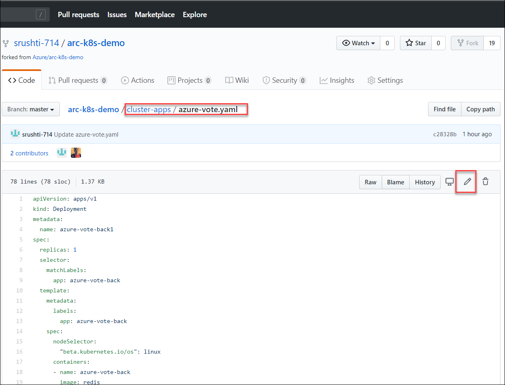
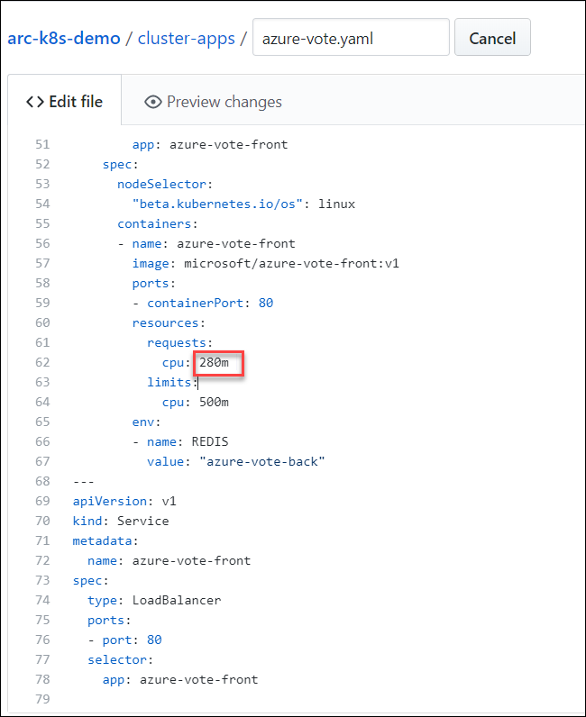
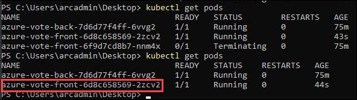
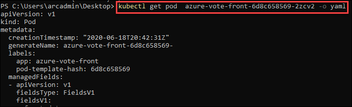

# Exercise 6: Update Configuration of the Kubernetes CLuster
In this exercise, we will update the configuration in the repository which have linked to our connected cluster and verify if cluster is getting updated

## Task 1: Make changes to cluster declarations in the Git repo.

1.  Run the following command in Powershell window and confirm that the Age is the same for both azure-vote-back and azure-vote-front apps. It will be same since the deployment was done through az k8sconfiguration command.

    ```
    kubectl get pods 
    ```
       

2. Browse to the forked repo of https://github.com/Azure/arc-k8s-demo

3. Navigate to **cluster-apps->azure-vote.yaml** and edit the yaml file

      

4. Change the cpu request from 250 to **280** in line 62 

      

## Task2: Verify changes are deployed to the cluster.

1.  Run the following command and copy the pod name starting with **azure-vote-front-**

    ```
    kubectl get pods 
    ```
     
    
    Observe in the above image that the previous pod is terminated and a new pod is created based on the updated configuration

2.  Replace the pod name that you copied in the previous step and run the command
 
    ```
    kubectl get pod <podname> -o yaml
    ```
       
    
    Observe the CPU request value that you updated in the previous steps in the output as shown:
    
       

