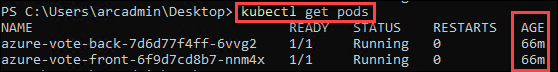

# Exercise 7: Optional Exercise - Setting up GitOps Workflow with a repo having Helm Charts
Helm is an open-source packaging tool that helps you install and manage the lifecycle of Kubernetes applications. Similar to Linux package managers such as APT and Yum, Helm is used to manage Kubernetes charts, which are packages of preconfigured Kubernetes resources.

The Helm operator provides an extension to Flux that automates Helm Chart releases. A Chart release is described through a Kubernetes custom resource named HelmRelease. Flux synchronizes these resources from git to the cluster, and the Helm operator makes sure Helm charts are released as specified in the resources.

In this exercise, we will see how to configure and use Helm with Azure Arc enabled Kubernetes

## Task 1: Use GitOps with Helm for an Azure Arc-enabled cluster configuration

1.  Run the following command in Powershell window to set the environment variable which will be used in the next steps. Replace in the two commands the name of the Resource  group where Azure Arc enabled Kubernetes cluster is deployed and the name of ARC enabled Kubernetes Cluster Name

    ```
    $RESOURCE_GROUP=<Resource_Group_Name>
    $CLUSTER_NAME=<ARCenabledKubernetesClusterName>
    ```
     
    
2.  For this exercise, you will use the following sample repository: https://github.com/Azure/arc-helm-demo.git

      

3.  This is the structure of the Git Repo:

    ```
    ├── charts
    │   └── azure-vote
    │       ├── Chart.yaml
    │       ├── templates
    │       │   ├── NOTES.txt
    │       │   ├── deployment.yaml
    │       │   └── service.yaml
    │       └── values.yaml
    └── releases
        └── prod
            └── azure-vote-app.yaml 
    ```
      
    
3.  In the git repo we have two directories, one containing a Helm chart and one containing the releases config. In the releases/prod directory the azure-vote-app.yaml contains the HelmRelease config.
 
4.  Run the following command in Powershell to link the connected cluster to the git repository:

    ```
    az k8sconfiguration create --name azure-voting-app --resource-group  $RESOURCE_GROUP --cluster-name $CLUSTER_NAME --operator-instance-name azure-voting-app --operator-namespace prod --enable-helm-operator --helm-operator-version='0.6.0' --helm-operator-params='--set helm.versions=v3' --repository-url https://github.com/Azure/arc-helm-demo.git --operator-params='--git-readonly --git-path=releases/prod' --scope namespace --cluster-type connectedClusters 
    ```
      
    
5.  To validate if the sourceControlConfiguration was created, run the following command:

    ```
    az k8sconfiguration show --resource-group $RESOURCE_GROUP --name azure-voting-app --cluster-name $CLUSTER_NAME --cluster-type connectedClusters 
    ```
      
    
6.  Run the following command in Powershell to verify if the application is up and running:

    ```
    kubectl get svc/azure-vote-front -n prod
    ```
      
    
7.  Copy the external IP address from the output above and open it in a browser.
  
